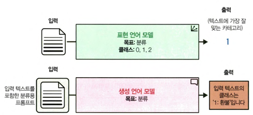
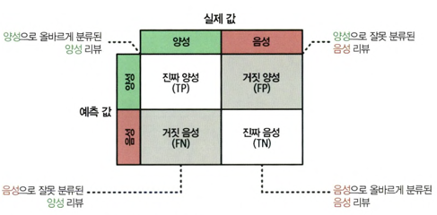
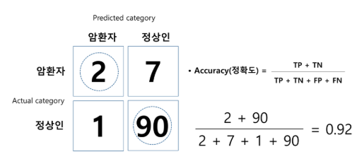
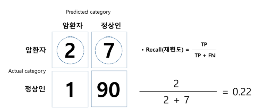
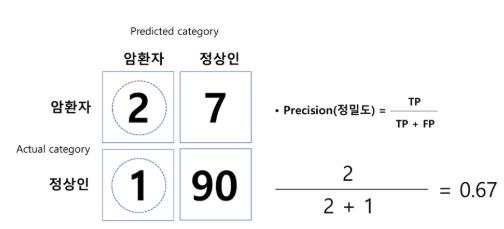
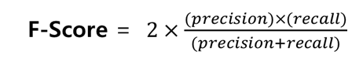

# 4장 텍스트 분류 학습 정리

## 📌 내용 요약

* 텍스트 분류는 **주어진 텍스트(문장, 문서 등)에 사전에 정의된 범주(클래스, 레이블)를 자동으로 할당하는 작업**.
* → 쉽게 말해, "이 글은 어떤 성격을 가진 글인가?"를 판별하는 것.
* 예시 :
    1. 영화 리뷰 → 긍정 / 부정
    2. 이메일 → 스팸 / 정상
    3. 고객 문의 → 환불 / 배송 / 계정 문제

    

* 접근 방식은 크게 세 가지:

  1. **표현 모델(Representation LM)** → 임베딩 벡터를 분류기에 입력.
  2. **임베딩 기반 접근** → 범용 임베딩 모델 + 전통 ML 분류기.
  3. **생성 모델(Generative LM)** → 프롬프트 기반으로 클래스 직접 출력(T5, ChatGPT).

* 성능 평가 지표 :
    1. 정확도(Accuracy): 전체 예측 중에서 맞춘 비율
    2. 정밀도(Precision): 모델이 "긍정(맞다)"라고 예측한 것 중 실제로 맞은 비율
    3. 재현율(Recall): "실제로 맞는 것" 중에서 모델이 놓치지 않고 맞춘 비율
    4. F1 점수: 정밀도(Precision)와 재현율(Recall)의 조화 평균 → 불균형 데이터셋에서도 신뢰할수 있는 지표

---

## 🤔 공부 중 헷갈리거나 어려웠던 점

* **모델 선택 기준**

  * 어떤 모델을 선택해야 할지 판단 기준이 모호.

### 1. 표현 모델 (Representation LM)

* **개념**

  * BERT, DistilBERT 같은 **사전훈련 언어모델**을 활용.
  * 텍스트를 입력 → 토큰화 → 내부적으로 **임베딩 벡터** 생성 → 분류기(Dense Layer, Softmax 등)를 붙여 학습.
* **특징**

  * 모델이 문맥 정보를 잘 반영 → 높은 정확도.
  * 특정 태스크에 맞춰 **미세 튜닝(fine-tuning)** 필요.
* **장점**

  * 최신 성능, 문맥 이해가 뛰어남.
* **단점**

  * 학습 비용이 크고 GPU 자원이 필요.

---

### 2. 임베딩 기반 접근

* **개념**

  * **범용 임베딩 모델**(예: Sentence-BERT, Universal Sentence Encoder)로 텍스트를 벡터화.
  * 이 벡터를 **전통적인 머신러닝 분류기**(로지스틱 회귀, SVM, 랜덤포레스트 등)에 입력.
* **특징**

  * 모델을 직접 미세 튜닝하지 않고도 다양한 분류 작업 가능.
  * "텍스트 → 임베딩 → ML 분류기" 구조.
* **장점**

  * GPU 없어도 실행 가능, 빠르고 가볍다.
  * 라벨이 적은 데이터에서도 활용 가능.
* **단점**

  * 임베딩 품질에 따라 성능이 좌우.
  * 도메인 특화 성능은 표현 모델보다 약함.

---

### 3. 생성 모델 (Generative LM)

* **개념**

  * GPT, T5 같은 **생성 언어모델** 사용.
  * 텍스트와 함께 \*\*분류 지시(prompt)\*\*를 주면, 모델이 클래스명을 직접 출력.
  * 예:

    ```
    프롬프트: "문장: 'This movie was fantastic!' → 감성은?"
    출력: "positive"
    ```
* **특징**

  * 분류기를 따로 붙이지 않아도 됨.
  * Zero-shot / Few-shot 학습 가능 (예시 없이 or 몇 개의 예시만 주고도 수행).
* **장점**

  * 라벨이 없는 데이터에도 적용 가능.
  * 다양한 태스크에 빠르게 활용.
* **단점**

  * 결과가 프롬프트 품질에 민감.
  * 일관성이 부족할 수 있음.

---

### 📊 차이 요약 (비교표)

| 구분         | 표현 모델 (Representation LM) | 임베딩 기반 접근          | 생성 모델 (Generative LM)  |
| ---------- | ------------------------- | ------------------ | ---------------------- |
| **구조**     | 텍스트 → 임베딩 → 분류기           | 텍스트 → 임베딩 → 전통 ML  | 텍스트 + 프롬프트 → 클래스 직접 출력 |
| **대표 모델**  | BERT, DistilBERT          | Sentence-BERT, USE | T5, ChatGPT            |
| **학습 필요성** | Fine-tuning 필요            | 분류기만 학습            | 학습 불필요 (프롬프트 설계만)      |
| **자원 요구**  | GPU 필수, 비용 큼              | CPU로도 가능, 가벼움      | API 호출만으로 가능           |
| **장점**     | 높은 정확도, 문맥 이해             | 빠르고 가볍다            | Zero/Few-shot 가능       |
| **단점**     | 비용 큼, 자원 요구               | 임베딩 품질 한계          | 프롬프트 품질 의존, 불안정        |

---

✅ **정리**

* **표현 모델**: 성능 최우선, 자원과 시간이 충분할 때 적합.
* **임베딩 기반**: 가볍고 빠른 배포/실무 적용에 유리.
* **생성 모델**: 데이터 라벨 부족·빠른 프로토타입 단계에 강점.

### **혼동 행렬(Confusion Matrix)**

  * 행은 실제 값, 열은 예측 값 → 정밀도(Precision), 재현율(Recall) 계산 시 헷갈림.
  * 특히 이진 분류에서 \*\*FN(False Negative)\*\*와 **FP(False Positive)** 차이를 구분하는 게 중요.

  

### 정확도
  * 예측 모형의 전체적인 정확도를 평가한다. 예를 들어 관심범주가 암환자라고 한다면 암환자를 암환자로 예측하고, 정상인을 정상인으로 예측한 비율을 의미

  

  * 모델의 정확도가 92%로써 굉장히 높지만 암환자만 따로 떼어 놓고 보면 성능이 별로 좋지 못하다. 즉 암환자가 실제로 9명(2+7) 존재하는데 2명만 암환자로 예측

### 재현도
  * 예측 모델이 실제 데이터에서 존재하는 암환자(관심범주) 중 몇 개를 암환자로 예측했는지에 대한 수치 
  * 만약 암환자의 경우처럼 관심범주 예측이 굉장히 중요한 범주형 예측 모델에서는 재현도 값이 실질적으로 더 의미 있는 모델 성능 값

  

### 정밀도
  * 예측의 질(quality)에 대한 수치

  

  * 예측 모델은 총 3명이 암환자라고 예측했고, 그 중에 2명을 제대로 맞췄으니까 약 67%의 정밀도를 갖는다. 비록 암환자 예측을 깐깐하게 했지만 예측 자체의 정확도는 약간 높다고 볼 수 있다

### F스코어
  * 결국 좋은 예측 모델은 재현도와 정밀도가 동시에 좋아야 한다. 어느 한쪽의 값을 높이기 위해서 다른 한쪽 수치의 질을 희생시켜서는 안될 것

  

  * F 스코어는 재현도와 정밀도가 둘다 높으면 F 스코어도 높고, 어느 한쪽이 낮거나 둘 다 낮으면 F스코어가 낮아지도록 고안된 수식

✅ **정리**

* 범주형 변수 예측 모형의 성능은 혼동행렬표 상의 정확도, 재현도, 정밀도, F 스코어로 측정하고, 예측하려는 변수의 특징과 상황에 따라 네 가지 성능 평가 수치를 적절하게 활용해야함.
---

## 💡 추가 정보 / 팁

* Hugging Face Hub 활용 → 도메인별 사전학습 모델을 빠르게 검색 가능.
* **임베딩 모델 + 로지스틱 회귀** 방식은 GPU 없이도 충분히 높은 성능 제공.
* ChatGPT 같은 생성 모델은 **Zero-shot 분류**가 가능 → 라벨 데이터가 부족할 때 특히 유용.
* 평가 시 단순 Accuracy보다 **F1-score(특히 weighted avg)** 활용이 실전적.

---

## 🚀 느낀 점 및 강조할 부분

* 텍스트 분류는 LLM 활용의 **출발점**이자 다른 고급 작업(클러스터링, RAG 등)의 **기초**가 됨.
* "모델 선택은 상황 의존적이다" → 데이터 크기, 도메인 특화 여부, 컴퓨팅 리소스를 고려해야 함.
* 단순히 모델을 돌리는 것에 그치지 않고, **평가 지표를 제대로 이해하고 선택**해야 신뢰할 수 있는 결과 확보 가능.
* 생성 모델 기반 접근(T5, ChatGPT)이 가져오는 **패러다임 변화**가 인상적 → 앞으로는 프롬프트 엔지니어링이 분류 작업에서도 필수 역량이 될 것.